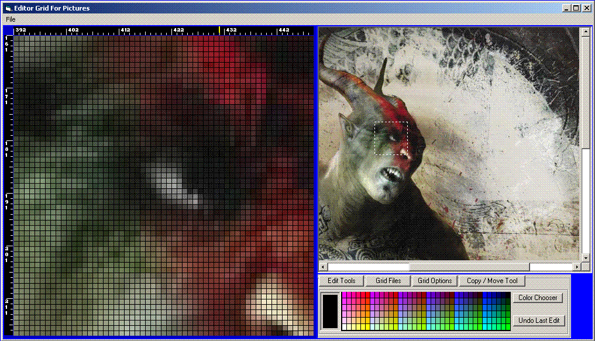



## Picture Grid

### Description

1-07-08 Some serious problems fixed: Read the readme. Thanks for your support and sorry for the bad upload.

1-04-08 This update finishes this editors features.

and includes error handlers. NOTE:This includes a fix for the resize code that caused the app to crash. The readme has also been updated.

12-25 here is another update for the program i wasn't going to update again. Speed boost, a few more options and a little cleaner interface. still not using copy memory; however, It s still fast. Enjoy the code, thanks for the votes, and have a happy new year.

Updated 12-17-07 :

I wasn't going to update this again until I had it working with "copymemory" API but it seems that at least a few people like the ideas here so I didn&#8217;t feel good about having a known error in the posted source. Also, the help was a little vague so I also wanted to improve it. A few notes first however, this is only a test app for the functions presented in the source.

The UI leaves a lot to be desired when it comes to looks and usability but the ideas work.

Note: I am working on another version using copyMemory and hoping to spruce up the UI a little but I wouldn't look for to much, I do like everything handy and cramped.

Marry Christmas to you all, and God bless you.

Read the readme for the new help.
 
### More Info
 

             |
---                |---
**Submitted On**   |2008-01-07 17:14:36
**By**             |[Russell Sanders](https://github.com/Planet-Source-Code/PSCIndex/blob/master/ByAuthor/russell-sanders.md)
**Level**          |Beginner
**User Rating**    |4.9 (49 globes from 10 users)
**Compatibility**  |VB 6\.0
**Category**       |[Graphics](https://github.com/Planet-Source-Code/PSCIndex/blob/master/ByCategory/graphics__1-46.md)
**World**          |[Visual Basic](https://github.com/Planet-Source-Code/PSCIndex/blob/master/ByWorld/visual-basic.md)
**Archive File**   |[Picture\_Gr209645172008\.zip](https://github.com/Planet-Source-Code/russell-sanders-picture-grid__1-69729/archive/master.zip)

